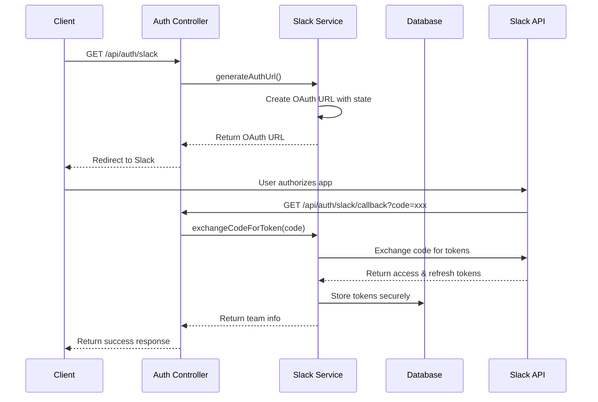
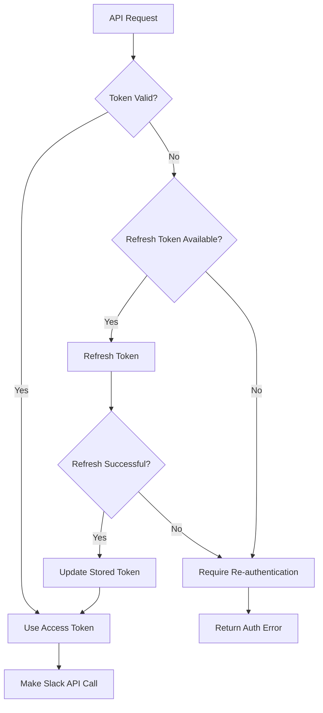
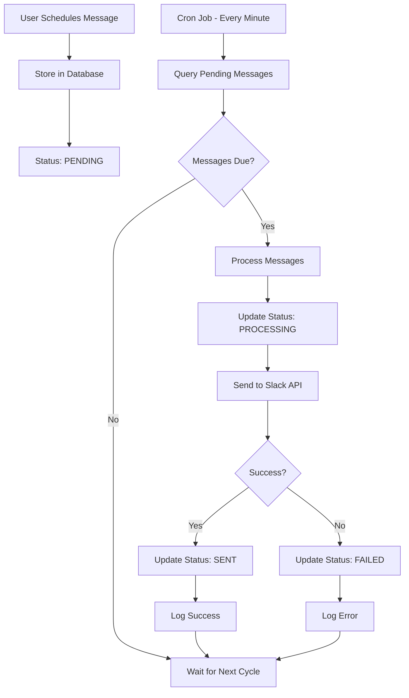
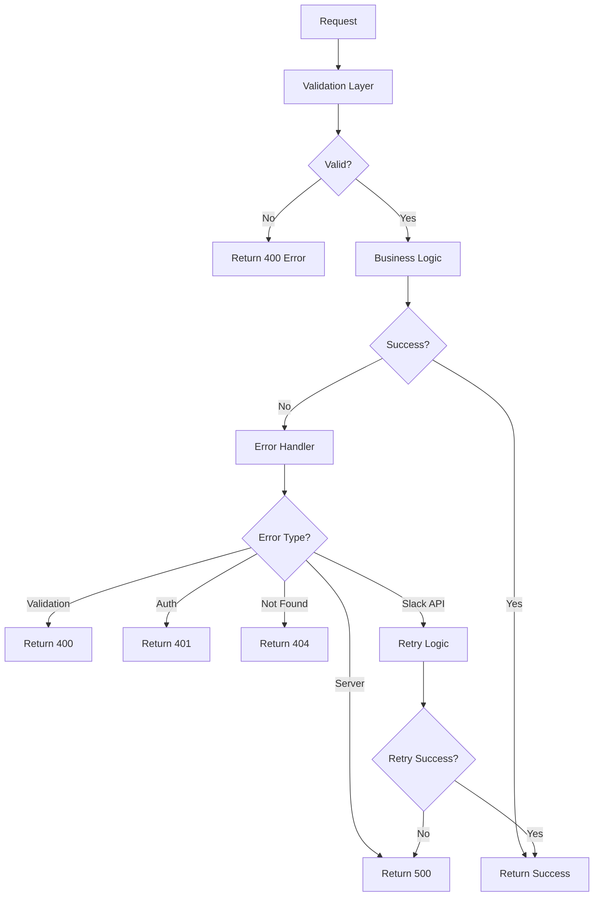

# Slack Connect - Backend Server

A robust Node.js backend service that handles Slack OAuth authentication, token management, message sending, and scheduled message processing.

## 🚀 Features

- **OAuth 2.0 Flow**: Complete Slack workspace authentication
- **Token Management**: Secure storage and automatic refresh of access/refresh tokens
- **Message Sending**: Send messages to Slack channels via API
- **Message Scheduling**: Schedule messages for future delivery with cron jobs
- **Database Persistence**: SQLite database for storing tokens and scheduled messages
- **Error Handling**: Comprehensive error handling and logging
- **API Documentation**: Well-documented REST API endpoints

## 🛠️ Tech Stack

- **Runtime**: Node.js
- **Framework**: Express.js 5.1.0
- **Language**: TypeScript 5.9.2
- **Database**: SQLite3 5.1.7
- **Authentication**: Slack OAuth 2.0
- **Scheduling**: Node-cron 4.2.1
- **Validation**: Zod 4.1.5
- **HTTP Client**: Axios (for Slack API calls)

## 📋 Prerequisites

Before you begin, ensure you have the following installed:

- **Node.js** (version 18.0 or higher)
- **npm** or **yarn** package manager
- **Git** for version control
- **Slack App**: Create a Slack app with OAuth permissions

## 🔧 Installation

1. **Clone the repository**
   ```bash
   git clone <repository-url>
   cd slack-connect-server
   ```

2. **Install dependencies**
   ```bash
   npm install
   # or
   yarn install
   ```

3. **Environment Configuration**
   Create a `.env` file in the root directory:
   ```env
   # Server Configuration
   PORT=5000
   NODE_ENV=development
   
   # Slack App Configuration
   SLACK_CLIENT_ID=your_slack_client_id
   SLACK_CLIENT_SECRET=your_slack_client_secret
   SLACK_REDIRECT_URI=http://localhost:5173/oauth-callback.html
   
   # CORS Configuration
   CORS_ORIGIN=http://localhost:5173
   
   # Database Configuration
   DATABASE_PATH=./database.sqlite
   ```

4. **Build the application**
   ```bash
   npm run build
   ```

5. **Start the server**
   ```bash
   # Development
   npm run dev
   
   # Production
   npm start
   ```

## 🔑 Slack App Setup

### 1. Create a Slack App

1. Go to [Slack API](https://api.slack.com/apps)
2. Click "Create New App"
3. Choose "From scratch"
4. Enter app name and select workspace

### 2. Configure OAuth & Permissions

1. Go to "OAuth & Permissions" in your app settings
2. Add the following redirect URLs:
   - `https://your-domain.com/api/auth/slack/callback` (production)

3. Add the following Bot Token Scopes:
   - `chat:write` - Send messages to channels
   - `channels:read` - List public channels
   - `groups:read` - List private channels

### 3. Install App to Workspace

1. Go to "Install App" in your app settings
2. Click "Install to Workspace"
3. Copy the Client ID and Client Secret to your `.env` file

## 🏗️ Project Structure

```
slack-connect-server/
├── src/
│   ├── auth/
│   │   └── routes.ts           # Authentication routes
│   ├── config/
│   │   ├── database.ts         # Database configuration
│   │   └── envrioment.ts       # Environment variables
│   ├── constants/
│   │   ├── app.constants.ts    # Application constants
│   │   ├── messages.constants.ts # Error/success messages
│   │   ├── queries.constants.ts  # SQL queries
│   │   ├── table.constants.ts    # Database table names
│   │   ├── uri.constants.ts      # API endpoints
│   │   └── index.ts             # Barrel exports
│   ├── controllers/
│   │   ├── auth.controllers.ts  # Auth controller logic
│   │   └── slack.controllers.ts # Slack operations controller
│   ├── routes/
│   │   ├── auth.routes.ts       # Auth route definitions
│   │   └── slack.routes.ts      # Slack route definitions
│   ├── services/
│   │   ├── slack.service.ts     # Slack API integration
│   │   ├── scheduled.message.service.ts # Message scheduling
│   │   ├── retry.service.ts     # Retry logic for API calls
│   │   └── validation.service.ts # Input validation
│   ├── types/
│   │   └── index.ts             # TypeScript type definitions
│   └── index.ts                 # Application entry point
├── dist/                        # Compiled JavaScript
├── database.sqlite              # SQLite database file
├── package.json
├── tsconfig.json
└── README.md
```

## 🏗️ Architectural Overview

### System Architecture

The Slack Connect backend follows a layered architecture pattern with clear separation of concerns:

```
┌─────────────────────────────────────────────────────────────┐
│                    Presentation Layer                       │
│  ┌─────────────────┐  ┌─────────────────┐  ┌─────────────┐  │
│  │   Auth Routes   │  │  Slack Routes   │  │   CORS      │  │
│  │   /auth/*       │  │  /slack/*       │  │  Middleware │  │
│  └─────────────────┘  └─────────────────┘  └─────────────┘  │
└─────────────────────────────────────────────────────────────┘
┌─────────────────────────────────────────────────────────────┐
│                    Business Logic Layer                     │
│  ┌─────────────────┐  ┌─────────────────┐  ┌─────────────┐  │
│  │ Auth Controller │  │Slack Controller │  │Validation   │  │
│  │                 │  │                 │  │Service      │  │
│  └─────────────────┘  └─────────────────┘  └─────────────┘  │
└─────────────────────────────────────────────────────────────┘
┌─────────────────────────────────────────────────────────────┐
│                      Service Layer                          │
│  ┌─────────────────┐  ┌─────────────────┐  ┌─────────────┐  │
│  │ Slack Service   │  │Scheduled Message│  │Retry Service│  │
│  │                 │  │Service          │  │             │  │
│  └─────────────────┘  └─────────────────┘  └─────────────┘  │
└─────────────────────────────────────────────────────────────┘
┌─────────────────────────────────────────────────────────────┐
│                      Data Layer                             │
│  ┌─────────────────┐  ┌─────────────────┐  ┌─────────────┐  │
│  │   SQLite DB     │  │   Slack API     │  │Environment  │  │
│  │                 │  │   (External)    │  │Config       │  │
│  └─────────────────┘  └─────────────────┘  └─────────────┘  │
└─────────────────────────────────────────────────────────────┘
```

### OAuth 2.0 Implementation

#### **Authentication Flow Architecture**


#### **Token Management Architecture**


### Message Scheduling Architecture

#### **Scheduling System Design**


#### **Cron Job Processing Flow**
1. **Trigger**: Every minute (`* * * * *`)
2. **Query**: Find messages with `status = 'pending'` and `scheduled_time <= now()`
3. **Process**: Atomic update to `status = 'processing'`
4. **Send**: Call Slack API to send message
5. **Update**: Mark as `'sent'` or `'failed'` based on result
6. **Log**: Record processing results for debugging

### Database Architecture

#### **Schema Design**
```sql
-- Tokens Table
CREATE TABLE slack_tokens (
  id INTEGER PRIMARY KEY AUTOINCREMENT,
  team_id TEXT UNIQUE NOT NULL,
  access_token TEXT NOT NULL,
  refresh_token TEXT,
  expires_at INTEGER,
  team_name TEXT,
  bot_token TEXT,
  created_at DATETIME DEFAULT CURRENT_TIMESTAMP,
  updated_at DATETIME DEFAULT CURRENT_TIMESTAMP
);

-- Scheduled Messages Table
CREATE TABLE scheduled_messages (
  id INTEGER PRIMARY KEY AUTOINCREMENT,
  team_id TEXT NOT NULL,
  channel_id TEXT NOT NULL,
  channel_name TEXT NOT NULL,
  message TEXT NOT NULL,
  scheduled_time INTEGER NOT NULL,
  status TEXT DEFAULT 'pending',
  created_at DATETIME DEFAULT CURRENT_TIMESTAMP,
  updated_at DATETIME DEFAULT CURRENT_TIMESTAMP,
  FOREIGN KEY (team_id) REFERENCES slack_tokens (team_id)
);
```

#### **Data Flow Architecture**
```
┌─────────────┐    ┌─────────────┐    ┌─────────────┐
│   OAuth     │───►│   Tokens    │───►│  Messages   │
│   Flow      │    │   Table     │    │   Table     │
└─────────────┘    └─────────────┘    └─────────────┘
       │                   │                   │
       ▼                   ▼                   ▼
┌─────────────┐    ┌─────────────┐    ┌─────────────┐
│   Client    │    │   Token     │    │   Cron      │
│   Auth      │    │   Refresh   │    │   Jobs      │
└─────────────┘    └─────────────┘    └─────────────┘
```

### Service Layer Architecture

#### **Slack Service Design**
```typescript
class SlackService {
  // Token Management
  async getValidToken(teamId: string): Promise<string>
  private async refreshToken(teamId: string, refreshToken: string): Promise<string>
  private async storeToken(tokenData: SlackToken): Promise<void>
  
  // API Operations
  async getChannels(teamId: string): Promise<SlackChannel[]>
  async sendMessage(teamId: string, channelId: string, message: string): Promise<void>
  async joinChannel(teamId: string, channelId: string): Promise<JoinResult>
}
```

#### **Scheduled Message Service Design**
```typescript
class ScheduledMessageService {
  // Scheduling
  async scheduleMessage(data: ScheduleMessageData): Promise<number>
  async getScheduledMessages(teamId: string): Promise<ScheduledMessage[]>
  async cancelScheduledMessage(messageId: number, teamId: string): Promise<void>
  
  // Processing
  private async processPendingMessages(): Promise<void>
  private async sendScheduledMessage(message: ScheduledMessage): Promise<void>
  private async updateMessageStatus(messageId: number, status: string): Promise<void>
}
```

### Error Handling Architecture

#### **Error Handling Strategy**


#### **Error Categories**
- **Validation Errors**: Input validation failures (400)
- **Authentication Errors**: Token issues (401)
- **Not Found Errors**: Resource not found (404)
- **Slack API Errors**: External API failures (with retry)
- **Server Errors**: Internal server issues (500)

### Security Architecture

#### **Security Layers**
1. **Input Validation**: Zod schema validation for all inputs
2. **Authentication**: OAuth 2.0 with proper token management
3. **Authorization**: Team-based access control
4. **CORS Protection**: Configured cross-origin policies
5. **Error Sanitization**: No sensitive data in error responses
6. **Token Security**: Encrypted storage and secure transmission

#### **Token Security Flow**
```
┌─────────────┐    ┌─────────────┐    ┌─────────────┐
│   Client    │    │   Server    │    │   Database  │
│             │    │             │    │             │
│  No Tokens  │───►│  Validate   │───►│  Encrypted  │
│  Stored     │    │  & Refresh  │    │  Storage    │
└─────────────┘    └─────────────┘    └─────────────┘
```

### Performance Architecture

#### **Optimization Strategies**
- **Database Indexing**: Optimized queries with proper indexes
- **Connection Pooling**: Efficient database connections
- **Async Processing**: Non-blocking I/O operations
- **Caching**: In-memory caching for frequently accessed data
- **Retry Logic**: Exponential backoff for failed requests

#### **Scalability Considerations**
- **Horizontal Scaling**: Stateless design allows multiple instances
- **Database Optimization**: Indexed queries for performance
- **Memory Management**: Proper cleanup and garbage collection
- **Rate Limiting**: Respect Slack API rate limits

## 🔌 API Endpoints

### Authentication

| Method | Endpoint | Description |
|--------|----------|-------------|
| GET | `/api/auth/slack` | Get Slack OAuth URL |
| GET | `/api/auth/slack/callback` | Handle OAuth callback |

### Slack Operations

| Method | Endpoint | Description |
|--------|----------|-------------|
| GET | `/api/slack/channels/{teamId}` | Get available channels |
| POST | `/api/slack/send-message` | Send immediate message |
| POST | `/api/slack/schedule-message` | Schedule message |
| GET | `/api/slack/scheduled-messages/{teamId}` | Get scheduled messages |
| DELETE | `/api/slack/scheduled-messages/{messageId}` | Cancel scheduled message |
| GET | `/api/slack/db-status` | Check database status |

### Request/Response Examples

#### Send Message
```bash
POST /api/slack/send-message
Content-Type: application/json

{
  "teamId": "T1234567890",
  "channelId": "C1234567890",
  "message": "Hello from Slack Connect!"
}
```

#### Schedule Message
```bash
POST /api/slack/schedule-message
Content-Type: application/json

{
  "teamId": "T1234567890",
  "channelId": "C1234567890",
  "channelName": "general",
  "message": "Scheduled message",
  "scheduledTime": "2024-12-31T23:59:59.000Z"
}
```

## 🗄️ Database Schema

### Tables

#### `slack_tokens`
| Column | Type | Description |
|--------|------|-------------|
| id | INTEGER PRIMARY KEY | Auto-increment ID |
| team_id | TEXT UNIQUE | Slack team ID |
| access_token | TEXT | Slack access token |
| refresh_token | TEXT | Slack refresh token |
| expires_at | INTEGER | Token expiration timestamp |
| team_name | TEXT | Team name |
| bot_token | TEXT | Bot token |
| created_at | DATETIME | Creation timestamp |
| updated_at | DATETIME | Last update timestamp |

#### `scheduled_messages`
| Column | Type | Description |
|--------|------|-------------|
| id | INTEGER PRIMARY KEY | Auto-increment ID |
| team_id | TEXT | Slack team ID |
| channel_id | TEXT | Slack channel ID |
| channel_name | TEXT | Channel name |
| message | TEXT | Message content |
| scheduled_time | INTEGER | Scheduled timestamp |
| status | TEXT | Message status (pending/sent/failed) |
| created_at | DATETIME | Creation timestamp |
| updated_at | DATETIME | Last update timestamp |

## ⚙️ Configuration

### Environment Variables

| Variable | Description | Required | Default |
|----------|-------------|----------|---------|
| `PORT` | Server port | No | 5000 |
| `NODE_ENV` | Environment | No | development |
| `SLACK_CLIENT_ID` | Slack app client ID | Yes | - |
| `SLACK_CLIENT_SECRET` | Slack app client secret | Yes | - |
| `SLACK_REDIRECT_URI` | OAuth redirect URI | Yes | - |
| `CORS_ORIGIN` | CORS allowed origin | Yes | - |
| `DATABASE_PATH` | SQLite database path | No | ./database.sqlite |

### CORS Configuration

The server is configured to accept requests from the frontend origin. Update `CORS_ORIGIN` for production deployment.

## 🔄 Message Scheduling

### How It Works

1. **Scheduling**: Messages are stored in the database with `pending` status
2. **Processing**: A cron job runs every minute to check for due messages
3. **Sending**: Messages are sent via Slack API and status updated to `sent`
4. **Error Handling**: Failed messages are marked as `failed` with error logging

### Cron Schedule

```javascript
// Runs every minute
'* * * * *'
```

### Message Status Flow

```
pending → processing → sent/failed
```

## 🔒 Security Features

- **Token Encryption**: Access tokens stored securely in database
- **CORS Protection**: Configured to allow only frontend origin
- **Input Validation**: All inputs validated using Zod schemas
- **Error Handling**: Comprehensive error handling without sensitive data exposure
- **Rate Limiting**: Built-in retry logic for API calls

## 🚀 Deployment

### Production Build

```bash
npm run build
```

### Environment Setup

For production, ensure all environment variables are properly configured:

```env
NODE_ENV=production
PORT=5000
SLACK_CLIENT_ID=your_production_client_id
SLACK_CLIENT_SECRET=your_production_client_secret
SLACK_REDIRECT_URI=http://your-frontend-domain/oauth-callback.html
CORS_ORIGIN=https://your-frontend-domain.com
```

### Deployment Platforms

- **Heroku**: Easy deployment with environment variables
- **Render**: Free tier available with automatic deployments
- **Railway**: Modern deployment platform
- **DigitalOcean**: VPS deployment option

### Docker Deployment

```dockerfile
FROM node:18-alpine
WORKDIR /app
COPY package*.json ./
RUN npm ci --only=production
COPY dist ./dist
EXPOSE 5000
CMD ["node", "dist/index.js"]
```

## 🐛 Troubleshooting

### Common Issues

1. **Database Connection Issues**
   - Ensure SQLite file permissions
   - Check database path configuration
   - Verify database initialization

2. **Slack API Issues**
   - Verify Slack app configuration
   - Check OAuth redirect URLs
   - Ensure proper bot scopes

3. **Token Refresh Issues**
   - Check refresh token validity
   - Verify Slack app permissions
   - Review token expiration logic

4. **CORS Issues**
   - Update CORS_ORIGIN environment variable
   - Check frontend URL configuration
   - Verify HTTPS in production

### Logging

The application provides comprehensive logging:

- **Console Logs**: Development debugging
- **Error Logs**: API errors and failures
- **Database Logs**: Query execution and errors
- **Slack API Logs**: API call responses and errors

## 📊 Monitoring

### Health Check

```bash
GET /api/slack/db-status
```

Returns database connection status and basic statistics.

### Performance Monitoring

- Database query performance
- Slack API response times
- Message processing metrics
- Error rates and types

## 🔧 Development

### Available Scripts

```bash
# Start development server
npm run dev

# Build for production
npm run build

# Start production server
npm start

# Format code
npm run format
```

### Code Quality

- **TypeScript**: Strict type checking
- **ESLint**: Code linting (if configured)
- **Prettier**: Code formatting
- **Modular Architecture**: Well-organized code structure

## 📝 Contributing

1. Fork the repository
2. Create a feature branch (`git checkout -b feature/amazing-feature`)
3. Commit your changes (`git commit -m 'Add some amazing feature'`)
4. Push to the branch (`git push origin feature/amazing-feature`)
5. Open a Pull Request

## 🤝 Support

For support, email jatin.srivastaval1909@gmail.com or create an issue in the repository.

---

**Note**: This backend service requires a corresponding frontend application. Please refer to the frontend repository for client-side setup instructions.
